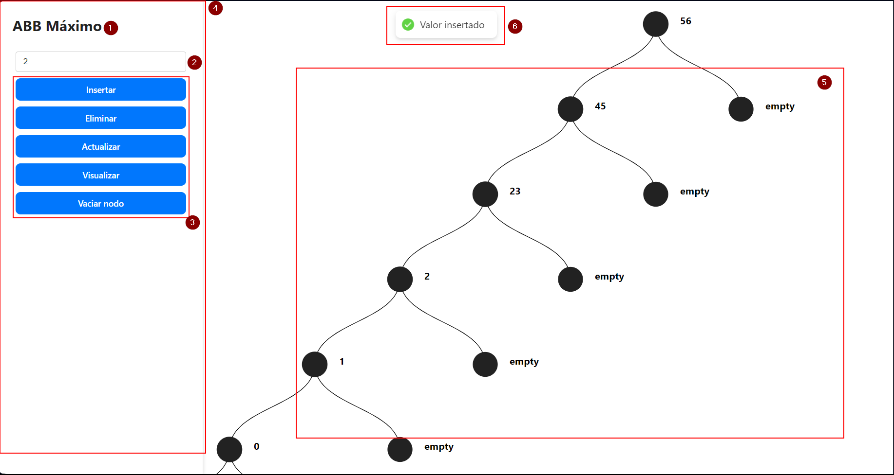

# MANUAL DEL USUARIO - Proyecto Árbol Binario de Búsqueda Máximo

## Autores

- Alejandro Soto Aguirre 21550303
- Azul Siret Cordero 21550381
- Naomi Regina Garcia Molina 21550292

05 de Diciembre de 2024

> ### Version 1.0

## Table de Contenidos
---
- [MANUAL DEL USUARIO - Proyecto Árbol Binario de Búsqueda Máximo](#manual-del-usuario---proyecto-árbol-binario-de-búsqueda-máximo)
  - [Autores](#autores)
  - [Table de Contenidos](#table-de-contenidos)
  - [Descripción](#descripción)
  - [Objetivos](#objetivos)
  - [Requsitos del Sistema](#requsitos-del-sistema)
  - [Acceso a la Aplicación](#acceso-a-la-aplicación)
  - [Funciones Principales](#funciones-principales)
    - [Insertar un valor](#insertar-un-valor)
    - [Eliminar un valor](#eliminar-un-valor)
    - [Actualizar un nodo](#actualizar-un-nodo)
    - [Visualizar el árbol](#visualizar-el-árbol)
    - [Vaciar un nodo o el árbol](#vaciar-un-nodo-o-el-árbol)
  - [Primera parte / Home - Página Principal](#primera-parte--home---página-principal)
  - [Consejos de uso](#consejos-de-uso)
  - [Resolución de Problemas](#resolución-de-problemas)
---

## Descripción

El presente manual de usuario tiene como finalidad dar a conocer de manera detallada y sencilla la estructura de la apliación ABB Máximo, para que cualquier usuario pueda sacar el maximo partido de la misma.

Es una aplicación que permite al usuario interactuar con un Árbol Binario de Búsqueda, realizando operaciones como insertar, eliminar, actualizar, visualizar y vaciar nodos.

## Objetivos

Este manual brinda una descripción clara y detallada sobre el funcionamiento y uso de los distintos elementos de la aplicación web para guiar al usuario en el uso de la misma.

## Requsitos del Sistema

- Tener un navegador web (Google Chrome, Mozilla Firefox, Microsoft Edge).
- Contar con acceso a internet.
- Tener un dispositivo con sistema operativo Windows, macOS o Linux.

## Acceso a la Aplicación

Para comenzar a usar ABB Máximo
1. Clona el repositorio:
    ```sh
    git clone https://github.com/Achellx/ProyectoProlog.git
    cd ProyectoProlog
    ```

2. Instala las dependencias del cliente React:
    ```sh
    cd react-cliente
    npm install
    ```

3. Inicia el servidor Prolog:
    ```sh
    swipl -s server.pl
    ```

4. Inicia el cliente React:
    ```sh
    npm run dev
    ```

## Funciones Principales

### Insertar un valor

- Ingresa un nímero en el campo de texto.
- Haz click en el botón `insertar`.
- Verifica que el valor aparezca en el arbol binario.

### Eliminar un valor
- Ingresa el número del nodo que deseas eliminar.
- Haz clic en el botón `Eliminar`.
- Confirma que el nodo desaparece del árbol.

### Actualizar un nodo

- Ingresa el número del nodo que deseas modificar.
- Haz clic en `Actualizar`.
- Sigue las instrucciones en pantalla (si aplica).
- Verifica que el valor se haya modificado en el árbol.

### Visualizar el árbol
- Haz clic en el botón `Visualizar`.
- Observa la estructura del árbol actualizada.

### Vaciar un nodo o el árbol
- Haz clic en el botón `Vaciar nodo`.
- Dependiendo del contexto, el árbol o nodo se eliminará. 

## Primera parte / Home - Página Principal

Una vez que el usuario ingresa a la Aplicación, lo primero que observa es la página principal del sitio. Esta será descrita a continuación:



1) El primer punto muestra el Titulo de la Aplicación.
2) Este es el `campo de texto` donde el usuario puede ingresar el valor que desee insertar en el árbol binario.
3) El recuadro rojo muestra los botones de acción que el usuario puede realizar en la Aplicación. `Insertar`, `Eliminar`, `Actualizar`, `Visualizar` y `Vaciar nodo`.
4) La zona cuatro es barra que contiene todos los botones para interactuar con la Aplicación.
5) La sección cinco es el área donde se visualizará el árbol binario que se esta contruuyendo, con sus nodos y sus valores.
6) La ultima sección muestra mensajes para confirmar las operaciones exitosas o errores al insertar valores.

## Consejos de uso

- Usa la función `Visualizar` frecuetemente para verificar la estructura del árbol.
- El árbol puede ser arrastrado y soltado para cambiar su posición en la pantalla, ademas de poder ser minimizado y maximizado.
- Familiarizarse con la estructura del árbol para entender mejor como se reorganizan los nodos.

## Resolución de Problemas

- **El valor no se inserta en el árbol**: 
  - Verifica que el valor ingresado sea un número entero y que el campo no este vacío. 
- **No puedo eliminar un nodo**:
  - Verificar que el valor ingresado corresponde a un nodo existente.
- **El árbol no se visualiza correctamente**:
  - Recarga la página y asegúrate de que tu navegador esta actualizado.
