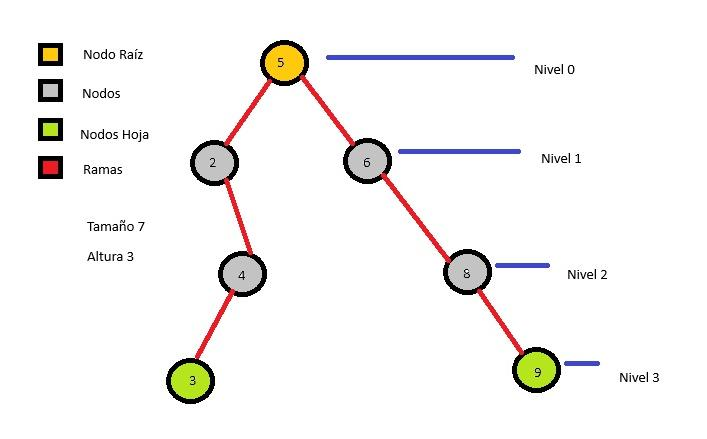

# Proyecto Árbol Binario de Búsqueda Máximo

Repositorio para el proyecto Árbol Binario de Búsqueda Máximo para la clase de Programación Lógica y Funcional de la Universidad ITCH II.



## Descripción

Este proyecto implementa un Árbol Binario de Búsqueda (ABB) en Prolog, con una interfaz de cliente en React. El objetivo es proporcionar una herramienta educativa para entender y manipular árboles binarios de búsqueda.

## Características

- **Inserción de valores**: Permite insertar nuevos valores en el árbol.
- **Eliminación de valores**: Permite eliminar valores existentes del árbol.
- **Actualización de valores**: Permite cambiar un valor existente por uno nuevo.
- **Visualización del árbol**: Muestra el árbol actual en formato JSON.
- **Vaciado del árbol**: Permite vaciar el árbol completamente.

## Tecnologías Utilizadas

- **Prolog**: Para la lógica del árbol binario de búsqueda.
- **React**: Para la interfaz de usuario.
- **Vite**: Para el desarrollo y construcción del proyecto React.
- **SWI-Prolog**: Servidor HTTP para manejar las solicitudes del cliente.

## Instalación

1. Clona el repositorio:
    ```sh
    git clone https://github.com/tu-usuario/proyecto-arbol-binario.git
    cd proyecto-arbol-binario
    ```

2. Instala las dependencias del cliente React:
    ```sh
    cd react-cliente
    npm install
    ```

3. Inicia el servidor Prolog:
    ```sh
    swipl -s server.pl
    ```

4. Inicia el cliente React:
    ```sh
    npm run dev
    ```

## Uso

- **Insertar Valor**: Envía una solicitud `POST` a `/api/insertar` con el valor a insertar.
- **Eliminar Valor**: Envía una solicitud `POST` a `/api/eliminar` con el valor a eliminar.
- **Actualizar Valor**: Envía una solicitud `POST` a `/api/cambiar` con el valor actual y el nuevo valor.
- **Mostrar Valores**: Envía una solicitud `GET` a `/api/mostrar` para obtener el árbol actual.
- **Vaciar Árbol**: Envía una solicitud `POST` a `/api/vaciar` para vaciar el árbol.

## Ejemplos de Solicitudes

### Insertar Valor

```sh
curl -X POST http://localhost:8080/api/insertar -H "Content-Type: application/json" -d '{"valor": 5}'
```

### Eliminar Valor

```sh
curl -X POST http://localhost:8080/api/eliminar -H "Content-Type: application/json" -d '{"valor": 5}'
```

### Actualizar Valor

```sh
curl -X POST http://localhost:8080/api/cambiar -H "Content-Type: application/json" -d '{"valor_actual": 5, "nuevo_valor": 10}'
```
