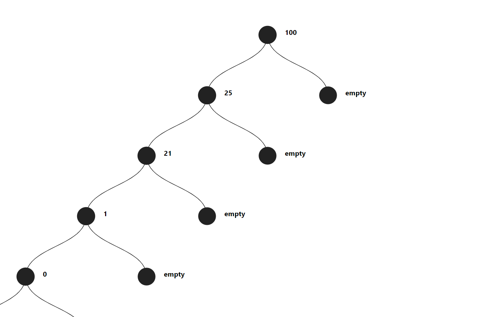
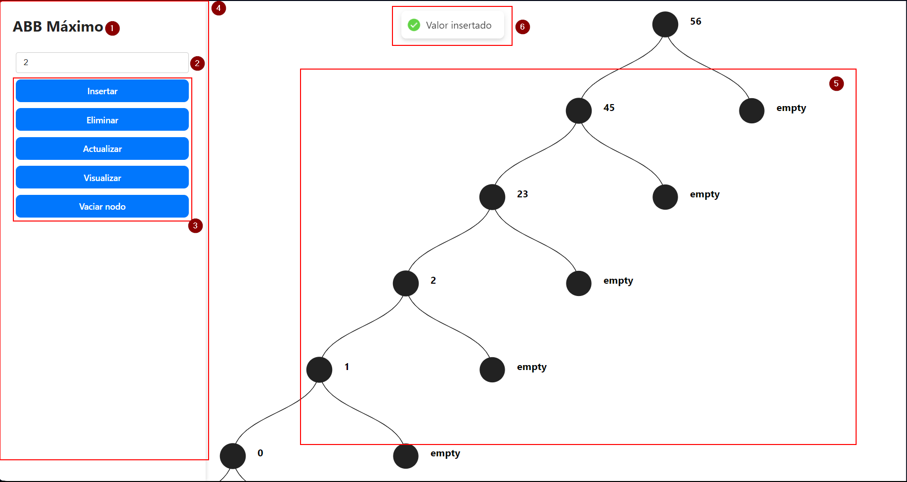

# MANUAL DEL PROGRAMADOR - Proyecto Árbol Binario de Búsqueda Máximo 

## Autores

- Alejandro Soto Aguirre 21550303
- Azul Siret Cordero 21550381
- Naomi Regina Garcia Molina 21550292

05 de Diciembre de 2024

> ### Version 1.0




## Descripción

Este proyecto implementa un Árbol Binario de Búsqueda (ABB) en Prolog, con una interfaz de cliente en React. El objetivo es proporcionar una herramienta educativa para entender y manipular árboles binarios de búsqueda.

## Alcance

El manual cubre la implementación del ABB en Prolog, así como la interfaz de cliente en React. Se incluyen ejemplos de uso y explicaciones detalladas de cada función. Esta dirigido a programadores y estudiantes de sistemas computacionales y/o carreras de desarrollo de software interesados en aprender sobre árboles binarios de búsqueda.


## Estructura del Proyecto

- **abb-maximo**: Contiene el backend de la aplicacion. Tiene la logica del árbol binario de búsqueda, ademas de la implementación de las funciones de inserción, búsqueda y eliminación de nodos. Aqui tambien se levanta el servidor.
- **react-cliente**: Contiene el frontend de la aplicacion, conlleva todos los componentes de la interfaz y el servicios que consume el backend.
    - **src**: Contiene la estructura de la aplicacion, incluyendo los componentes y servicios.
    - **components**: Contiene todos los componentes de la aplicacion.
    - **services**: Contiene la api para consumir el backend.
    - **styles**: Contiene las hojas de estilo de la aplicacion.
  
## Características

- **Inserción de valores**: Permite insertar nuevos valores en el árbol.
- **Eliminación de valores**: Permite eliminar valores existentes del árbol.
- **Actualización de valores**: Permite cambiar un valor existente por uno nuevo.
- **Visualización del árbol**: Muestra el árbol actual en formato JSON.
- **Vaciado del árbol**: Permite vaciar el árbol completamente.

## Tecnologías Utilizadas

- **Prolog**: Para la lógica del árbol binario de búsqueda.
- **React**: Para la interfaz de usuario.
- **Vite**: Para el desarrollo y construcción del proyecto React.
- **SWI-Prolog**: Servidor HTTP para manejar las solicitudes del cliente.

## Requsitios previos

- Tener instalado Node.js y npm.
- Contar con un editor de condigo.
- Tener instalado el paquete SWI-Prolog.

## Instalación

1. Clona el repositorio:
    ```sh
    git clone https://github.com/Achellx/ProyectoProlog.git
    cd ProyectoProlog
    ```

2. Instala las dependencias del cliente React:
    ```sh
    cd react-cliente
    npm install
    ```

3. Inicia el servidor Prolog:
    ```sh
    swipl -s server.pl
    ```

4. Inicia el cliente React:
    ```sh
    npm run dev
    ```

### Ejecución de microservicios

Este proyecto contiene la dependencia directa de un microservicio de Prolog y 1 terminal de Node para la ejecución, pues se ejecuta el entorno del Frontend y el Backend.

### Ejecución del API y Frontend

Para ejecutar sevidor y cliente, sigue los siguientes pasos:

1. Asegurate de que las dependencias esten instaladas en el directorio `root de este proyecto`.
2. Ejecuta el servidor de Prolog navegando al directorio `abb-maximo`:
    
    ```sh
    swipl -s server.pl
    ```
3. Para ejecutar el Frontend, navega a la carpeta `react-cliente`:

    ```sh 
    npm run dev
    ```
Estos pasos te permitirán tener la API y el Frontend en funcionamiento.

## Endpoints

* **GET** `/api/mostrar`: Mostrar todos los nodos:
  * Response:
  
    ```JSON
    {"arbol": [100,  [25,  [21,  [1,  [0,  [],  [] ],  [] ],  [] ],  [] ],  [] ]}
    ```
* **POST** `/api/insertar`: Crear un nuevo nodo:
    * Request:
  
        ```JSON
        {
            "valor" : 30
        }
        ```
    
    * Response:

        ```JSON
        {
            "arbol": [100,  [30,  [25,  [21,  [1,  [0,  [],  [] ],  [] ],  [] ],  [] ],  [] ],  [] ],
            "mensaje":"Valor insertado"
        }
        ```
* **POST** `/api/cambiar`: Cambiar el valor de un nodo:
  * Request:
  
    ```JSON
    {
        "valor_actual": 30,
        "nuevo_valor": 31
    }
    ```

  * Response:

    ```JSON
    {
        "arbol": [100,  [31,  [25,  [21,  [1,  [0,  [],  [] ],  [] ],  [] ],  [] ],  [] ],  [] ],
        "mensaje":"Valor cambiado"
    }
    ```
* **POST** `/api/eliminar`: Eliminar un nodo:
  * Request:

    ```JSON
    {
        "valor" : 31
    }
    ```

  * Reponse:

    ```JSON
    {
        "arbol": [100,  [25,  [21,  [1,  [0,  [],  [] ],  [] ],  [] ],  [] ],  [] ],
        "mensaje":"Valor eliminado"
    }
    ```


## Ejemplos de Solicitudes

### Insertar Valor

```sh
curl -X POST http://localhost:8080/api/insertar -H "Content-Type: application/json" -d '{"valor": 5}'
```

### Eliminar Valor

```sh
curl -X POST http://localhost:8080/api/eliminar -H "Content-Type: application/json" -d '{"valor": 5}'
```

### Actualizar Valor

```sh
curl -X POST http://localhost:8080/api/cambiar -H "Content-Type: application/json" -d '{"valor_actual": 5, "nuevo_valor": 10}'
```
---


# MANUAL DEL USUARIO - Proyecto Árbol Binario de Búsqueda Máximo

## Autores

- Alejandro Soto Aguirre 21550303
- Azul Siret Cordero 21550381
- Naomi Regina Garcia Molina 21550292

05 de Diciembre de 2024

> ### Version 1.0

## Table de Contenidos
---
- [MANUAL DEL PROGRAMADOR - Proyecto Árbol Binario de Búsqueda Máximo](#manual-del-programador---proyecto-árbol-binario-de-búsqueda-máximo)
  - [Autores](#autores)
  - [Descripción](#descripción)
  - [Alcance](#alcance)
  - [Estructura del Proyecto](#estructura-del-proyecto)
  - [Características](#características)
  - [Tecnologías Utilizadas](#tecnologías-utilizadas)
  - [Requsitios previos](#requsitios-previos)
  - [Instalación](#instalación)
    - [Ejecución de microservicios](#ejecución-de-microservicios)
    - [Ejecución del API y Frontend](#ejecución-del-api-y-frontend)
  - [Endpoints](#endpoints)
  - [Ejemplos de Solicitudes](#ejemplos-de-solicitudes)
    - [Insertar Valor](#insertar-valor)
    - [Eliminar Valor](#eliminar-valor)
    - [Actualizar Valor](#actualizar-valor)
- [MANUAL DEL USUARIO - Proyecto Árbol Binario de Búsqueda Máximo](#manual-del-usuario---proyecto-árbol-binario-de-búsqueda-máximo)
  - [Autores](#autores-1)
  - [Table de Contenidos](#table-de-contenidos)
  - [Descripción](#descripción-1)
  - [Objetivos](#objetivos)
  - [Requsitos del Sistema](#requsitos-del-sistema)
  - [Acceso a la Aplicación](#acceso-a-la-aplicación)
  - [Funciones Principales](#funciones-principales)
    - [Insertar un valor](#insertar-un-valor)
    - [Eliminar un valor](#eliminar-un-valor)
    - [Actualizar un nodo](#actualizar-un-nodo)
    - [Visualizar el árbol](#visualizar-el-árbol)
    - [Vaciar un nodo o el árbol](#vaciar-un-nodo-o-el-árbol)
  - [Primera parte / Home - Página Principal](#primera-parte--home---página-principal)
  - [Consejos de uso](#consejos-de-uso)
  - [Resolución de Problemas](#resolución-de-problemas)
---

## Descripción

El presente manual de usuario tiene como finalidad dar a conocer de manera detallada y sencilla la estructura de la apliación ABB Máximo, para que cualquier usuario pueda sacar el maximo partido de la misma.

Es una aplicación que permite al usuario interactuar con un Árbol Binario de Búsqueda, realizando operaciones como insertar, eliminar, actualizar, visualizar y vaciar nodos.

## Objetivos

Este manual brinda una descripción clara y detallada sobre el funcionamiento y uso de los distintos elementos de la aplicación web para guiar al usuario en el uso de la misma.

## Requsitos del Sistema

- Tener un navegador web (Google Chrome, Mozilla Firefox, Microsoft Edge).
- Contar con acceso a internet.
- Tener un dispositivo con sistema operativo Windows, macOS o Linux.

## Acceso a la Aplicación

Para comenzar a usar ABB Máximo
1. Clona el repositorio:
    ```sh
    git clone https://github.com/Achellx/ProyectoProlog.git
    cd ProyectoProlog
    ```

2. Instala las dependencias del cliente React:
    ```sh
    cd react-cliente
    npm install
    ```

3. Inicia el servidor Prolog:
    ```sh
    swipl -s server.pl
    ```

4. Inicia el cliente React:
    ```sh
    npm run dev
    ```

## Funciones Principales

### Insertar un valor

- Ingresa un nímero en el campo de texto.
- Haz click en el botón `insertar`.
- Verifica que el valor aparezca en el arbol binario.

### Eliminar un valor
- Ingresa el número del nodo que deseas eliminar.
- Haz clic en el botón `Eliminar`.
- Confirma que el nodo desaparece del árbol.

### Actualizar un nodo

- Ingresa el número del nodo que deseas modificar.
- Haz clic en `Actualizar`.
- Sigue las instrucciones en pantalla (si aplica).
- Verifica que el valor se haya modificado en el árbol.

### Visualizar el árbol
- Haz clic en el botón `Visualizar`.
- Observa la estructura del árbol actualizada.

### Vaciar un nodo o el árbol
- Haz clic en el botón `Vaciar nodo`.
- Dependiendo del contexto, el árbol o nodo se eliminará. 

## Primera parte / Home - Página Principal

Una vez que el usuario ingresa a la Aplicación, lo primero que observa es la página principal del sitio. Esta será descrita a continuación:



1) El primer punto muestra el Titulo de la Aplicación.
2) Este es el `campo de texto` donde el usuario puede ingresar el valor que desee insertar en el árbol binario.
3) El recuadro rojo muestra los botones de acción que el usuario puede realizar en la Aplicación. `Insertar`, `Eliminar`, `Actualizar`, `Visualizar` y `Vaciar nodo`.
4) La zona cuatro es barra que contiene todos los botones para interactuar con la Aplicación.
5) La sección cinco es el área donde se visualizará el árbol binario que se esta contruuyendo, con sus nodos y sus valores.
6) La ultima sección muestra mensajes para confirmar las operaciones exitosas o errores al insertar valores.

## Consejos de uso

- Usa la función `Visualizar` frecuetemente para verificar la estructura del árbol.
- El árbol puede ser arrastrado y soltado para cambiar su posición en la pantalla, ademas de poder ser minimizado y maximizado.
- Familiarizarse con la estructura del árbol para entender mejor como se reorganizan los nodos.

## Resolución de Problemas

- **El valor no se inserta en el árbol**: 
  - Verifica que el valor ingresado sea un número entero y que el campo no este vacío. 
- **No puedo eliminar un nodo**:
  - Verificar que el valor ingresado corresponde a un nodo existente.
- **El árbol no se visualiza correctamente**:
  - Recarga la página y asegúrate de que tu navegador esta actualizado.
